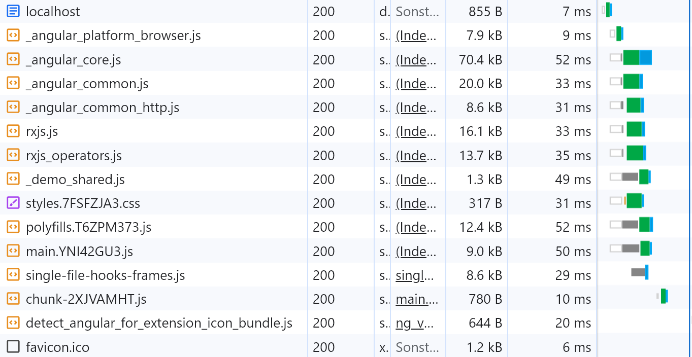

# Example: Loading Externals When Using esbuild

This example uses web standards for externals: EcmaScript Modules and Import Maps. This is basically what [Native Federation](https://www.angulararchitects.io/blog/micro-frontends-with-modern-angular-part-1-standalone-and-esbuild/) does, however, Native Federation adds more comfort on the top, making this here a black box.

## Try it out

1. npm run build
2. npm start
3. Open the browser at http://localhost:3000

In the dev tools' network tab, you should see now that libs are loaded as externals:

## Limitations

Currently, externals are only respected by ``ng build``. Regarding ``ng serve`` support, the Angular team has some ideas. [Native Federation](https://www.angulararchitects.io/blog/micro-frontends-with-modern-angular-part-1-standalone-and-esbuild/) already supports ``ng serve`` too by using a custom builder.

## How does it work?

1. The ``angular.json`` is configured to use the Angular CLI's new esbuild builder. Also, it defines that npm packages to share are external and, hence, not compiled together with the source code.
2. A post-build script (``postbuild.mjs``) called as part of ``npm run build`` compiles libraries to share into separate EcmaScript modules.
3. The postbuild script adds an Import Map to the ``index.html`` in the ``dist`` folder, mapping package names like ``@angular/core`` to the respective EcmaScript modules.
4. For the sake of performance, the post-build script also inserts preload instructions to the ``index.html`` (e.g., ``<link rel="modulepreload" href="_angular_core.js" />``)